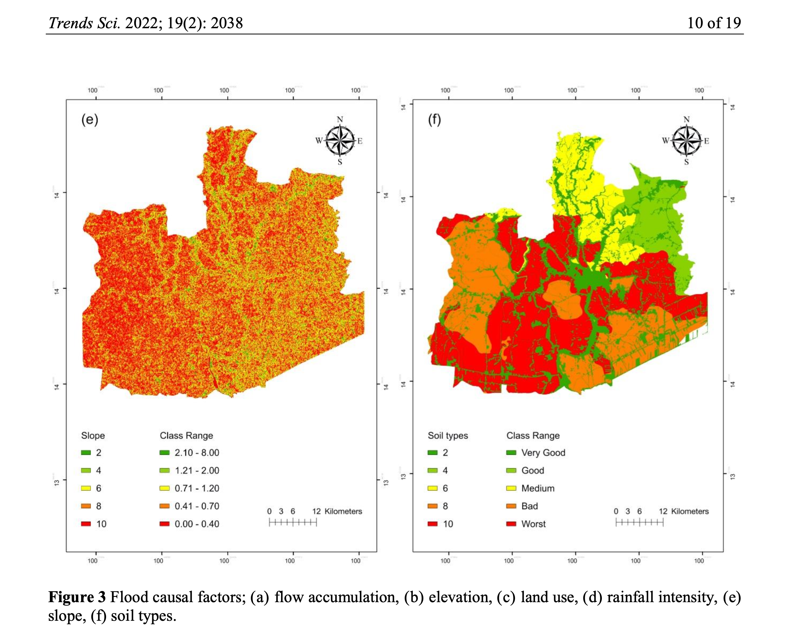

# 🌧️ **Advanced Machine Learning for Accurate Rainfall Prediction**

**Author**: [Teerapong (Kao) Panboonyuen](https://kaopanboonyuen.github.io/), [Thanat (Get) Vajeethaveesin](https://www.researchgate.net/profile/Thanat-Vajeethaveesin)

---

## 🔍 **Overview**
Welcome to the repository for advanced machine learning techniques aimed at enhancing rainfall prediction accuracy. This project explores a variety of models, including Random Forest, Gradient Boosting, and Neural Networks, to build a predictive model using relevant features from the dataset.



---

## 📊 **Dataset Access**
**Important**: The dataset used in this project is proprietary. Access requires permission from the [Geo-Informatics and Space Technology Development Agency (GISTDA Thailand)](https://www.gistda.or.th). Due to its private nature, the dataset is **not** included in this repository.

---

## 📄 **Publication**
Our findings are published in:

- **Title:** A Performance Comparison between GIS-based and Neural Network Methods for Flood Susceptibility Assessment in Ayutthaya Province
- **Authors:** Thanat Vajeethaveesin, Teerapong Panboonyuen
- **Journal:** Trends in Sciences, Vol. 19, No. 2, pp. 2038-2038, 2022
- **Link:** [Read the Paper](https://tis.wu.ac.th/index.php/tis/article/view/2038)

### 📝 **Abstract**
Flooding remains a significant challenge in Thailand due to its geographical setup. Flood susceptibility mapping is crucial for managing these events. Traditionally, the GIS-based FRAM model combined with AHP has been employed to create flood susceptibility maps. However, with the rise of machine learning, we explored the potential of Artificial Neural Networks (ANN) to enhance these maps. Our study compares the GIS approach and ANN, using Ayutthaya Province as a case study. Results show that ANN outperforms FRAM, providing more accurate flood susceptibility predictions using fewer causal factors.

### 📚 **Citation (BibTeX)**
```bibtex
@article{getandkao2022performance,
  title={A performance comparison between GIS-based and neural network methods for flood susceptibility assessment in Ayutthaya Province},
  author={Vajeethaveesin, Thanat and Panboonyuen, Teerapong},
  journal={Trends in Sciences},
  volume={19},
  number={2},
  pages={2038--2038},
  year={2022}
}
```

---

## 🚀 **Getting Started**

### 1. **Clone the Repository**
```bash
git clone https://github.com/kaopanboonyuen/rainfall-prediction-a-machine-learning-approach.git
cd rainfall-prediction-a-machine-learning-approach
```

### 2. **Install Dependencies**
```bash
pip install -r requirements.txt
```

### 3. **Run the Model**
Since the dataset is private, ensure you have access. Once obtained, you can train and evaluate the models with:
```bash
python run_model.py
```

---

## 🛠️ **Code Repository**
The full codebase for this project can be found [here](https://github.com/kaopanboonyuen/rainfall-prediction-a-machine-learning-approach).

---

## 🛡️ **License**
This project is licensed under the MIT License. For more details, see the [LICENSE](LICENSE) file.
```

This addition places the link to the code repository prominently, ensuring easy access for users.